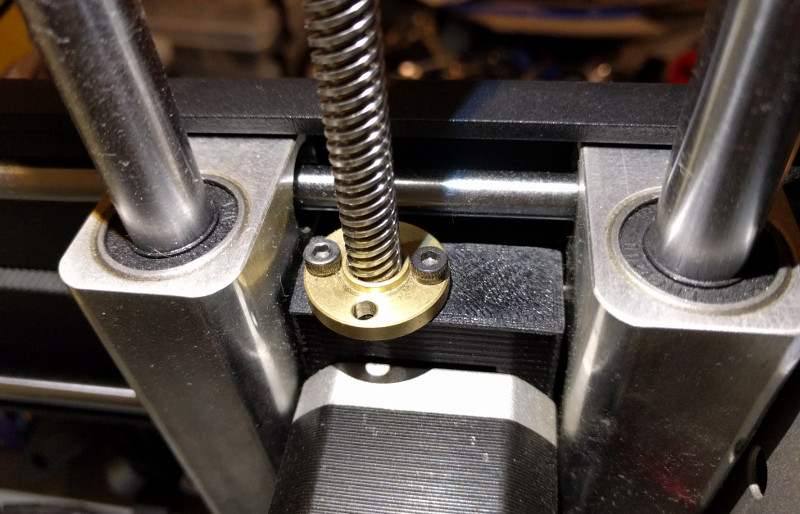
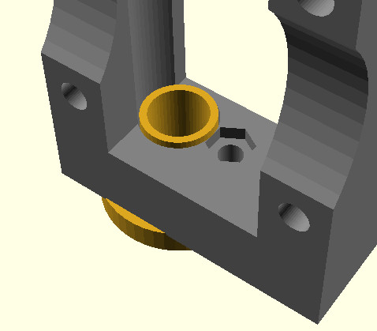
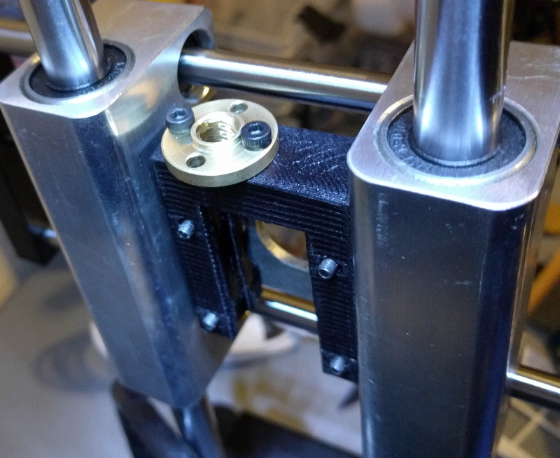
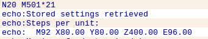

# PrintrBot Simple Metal Metric Z Conversion
With the PrintrBot Simple Metal approaching end of life, I've been thinking ahead in terms of replacement parts. Most of the parts on the PrintrBot are fairly generic or can at least be (relatively) easily swapped out with industry standard components, but one part that really worried me was the Delrin Z nut. This is one of the only parts on the printer that is both proprietary and consumable; eventually the nut will wear down and will need to be replaced.

Rather than buying a bunch of them to stock up for the future (though at the time of this writing, they are no longer available on the PrintrBot store anyway), I decided to replace the Z movement with a standard 8 mm lead screw that can easily be sourced online for a few dollars.

Beyond maintenance and availability issues, converting the PrintrBot's Z motion to metric can (in theory) improve print quality as the controller doesn't have to convert the metric dimensions of the printed part to the PrintrBot's original imperal threaded rod.

# Required Parts
* M3X15mm Cap Screws (x2)
* M3 Nut (x1)
* Brass T8 nut
* 250mm T8 Lead Screw
* 5mmx8mm Coupler (Either printed or purchased)

### Notes:
* Ideally you should get a T8 lead screw that includes a matching nut, but they can be purchased separately if you already have the lead screw.

* If you don't want to buy a Z coupler you can print it, [such as this one from FABlab Moebius](http://www.thingiverse.com/thing:533928).

* Don't be fooled by the length of the original threaded rod (~190mm), with the adapter the Z nut is now above the Y stepper instead of below it, so you need a lead screw that is significantly longer. Otherwise you'll drive the Y arm right off the lead screw if you tried to print something too high.

# Installation
After printing the adapter, press the M3 nut into the bottom and then use the two M3 screws to secure the brass Z nut to the top.



Once you're sure the brass Z nut fits into the adapter, you can remove the PrintrBot's Y arm, Y belt, and Y stepper. You can then remove the two white spacers, Delrin Z nut, 5mm threaded rod, and Z coupling. They will no longer be required, but I would keep them to be safe.



Install the adapter and Z nut in place of the original parts, then thread the lead screw through the top of the brass Z nut and down into the new Z coupling.

> **Note**: I found the easiest way to get everything aligned properly was to leave the stepper screws lose while seating the Z coupling and lead screw. Once the coupling and screw are installed properly, then tighten up the stepper screws.

Finally, put the Y stepper and belt back on, making sure that the belt isn't rubbing on the aluminum bearing block (you may need to move the sprocket slightly on the shaft). Also check the belt tightness before putting the Y arm back on.

# Firmware
With the new lead screw installed, you'll need to adjust the printer's firmware so that the steps-per-mm matches the new thread. You can use the [very handy RepRap Calculator](http://www.prusaprinters.org/calculator/#stepspermmlead), but assuming you got a standard 4 start T8 lead screw the steps will need to be set to 400.

To do that, you'll need to connect to the printer with your software of choice and execute the M92 code in the GCode input field. You'll then need to save it to the EEPROM with M500:

```
M92 Z400.00
M500
```

You can then check to make sure it was saved by running M501:



At that point the new values should be active, but I've found in the past it's wise to completely reboot the PrintrBot to make sure firmware settings take.

# Recalibrate Z Offset
After doing so much fiddling with the Z axis, you'll almost certainly need to recalibrate your offset. [Follow the official calibration process](https://www.youtube.com/watch?v=jpmgI4OGldw), and you should be good to do some test prints.

# Auto-Level Warning
As a side effect of this modification, the Z axis movement is now so smooth that the Y arm can actually slide down the rods from just its own weight.

This isn't really a problem normally, but I've found that if you then try and disable the PrintrBot's auto-leveling routine, the arm can actually fall back down while printing. This is evident by smashed up layers and the nozzle occasionally hitting the print. The issue appears to be that the controller turns off the Z stepper between layer changes unless the auto-leveling is actively moving it around.

The easy solution is to just not disable the auto-level routine. The "proper" solution appears to be editing the firmware to tell it to always keep the Z stepper energized; but unless you _really_ want to turn off the leveling, it probably isn't worth it.

# Modifications
The OpenSCAD source is included if you need to make any tweaks to the adapter, but you'll need to drop the ["nutsnbolts" OpenSCAD library](https://github.com/JohK/nutsnbolts) into the current directory before it will compile.

# Acknowledgements
- Makes use of Johannes Kneer's fantastic "nutsnbolts" library.
- Inspired by a design posted by ["aricnorine" on YouImagine](https://www.youmagine.com/designs/printrbot-simple-metal-z-axis-block-for-8mm-metric-coupler).

# License
This program is free software; you can redistribute it and/or modify it under the terms of the GNU General Public License version 3 as published by the Free Software Foundation.


This program is distributed in the hope that it will be useful, but WITHOUT ANY WARRANTY; without even the implied warranty of MERCHANTABILITY or FITNESS FOR A PARTICULAR PURPOSE.

For details, see the file "COPYING" in the source directory.
